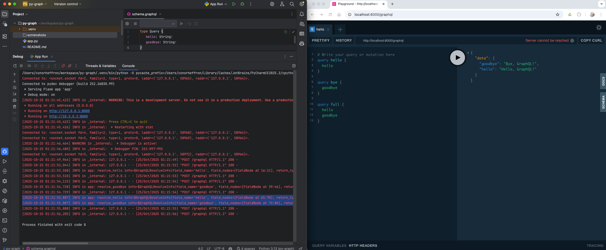

# py-flask-graph

[](https://www.gnu.org/licenses/gpl-3.0)

[](https://github.com/conorheffron/py-flask-graph/actions/workflows/python-app.yml)

### Run Flask App
```shell
sudo pipenv shell
```
```shell
pipenv install -r requirements.txt
```
```shell
bash ./run.sh 
```

OR

Run `App Run` profile in PyCharm

### Run Flask App (Startup Logs)
```
 * Serving Flask app 'app.py'
 * Debug mode: off
WARNING: This is a development server. Do not use it in a production deployment. Use a production WSGI server instead.
 * Running on http://127.0.0.1:8000
Press CTRL+C to quit
```

### Test Resolver with `hello` Query via curl:
```shell
curl -X POST \
-H "Content-Type: application/json" \
--data '{ "query": "{ hello }" }' \
http://localhost:8000/graphql
```  

### JSON Response
```json
{
  "data": {
    "hello": "Hello, GraphQL!"
  }
}
```

### GraphQL PlayGround
 - http://localhost:8000/graphql



### Add / Get Item GraphQL Samples
```graphql
query hi {
  hello
}

query bye {
  goodbye
}

query full_meeting {
  hello
  goodbye
  items {
    name
  }
}

query getItems {
  items {
    name
    quantity
  }
}

mutation addNewItem {
  addItem(name: "Oranges", quantity: 500) {
    name
    quantity
  }
}
```
